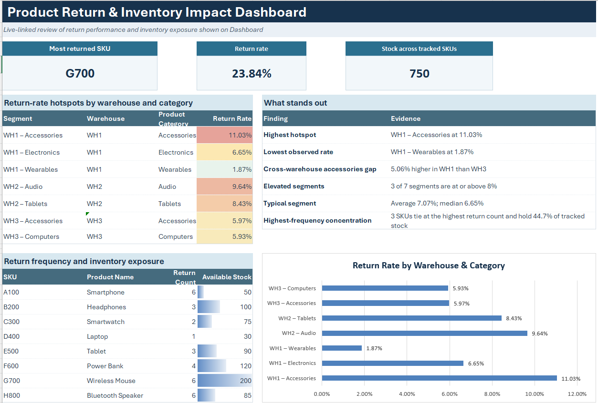

# Product Return & Inventory Impact Dashboard

An end-to-end Excel data analytics project analyzing product returns and inventory exposure to identify high-return SKUs, return-rate hotspots and stock exposure across tracked products.

**Tools used:** Excel (Power Pivot · Data Modeling · DAX · Pivot Tables · Pivot Charts)

## Data Source
 
Simulated retail operations data covering Orders, Returns, Inventory and Supplier Information across multiple product categories and warehouses, built to model a multi-SKU retail return and stock-tracking scenario.

## About This Project
 
End-to-end solo project covering data modelling, relationship design, KPI development and dashboard design, executed entirely within Excel's native Data Model and Power Pivot. The dynamic and live-linked Excel dashboard was built for a retail operations/inventory management audience and designed to support decisions on supplier quality, stock replenishment and warehouse-level investigation.

## Business Problem

The business is experiencing product returns that can increase operational costs, disrupt inventory planning and leave capital tied up in products with poor return performance. It needs to identify which products require the most attention and where return activity is creating the greatest inventory impact.

Before high-return products could be prioritized, two underlying questions needed answers:

1. **Return Impact** — Which SKUs and product categories generate the highest return volumes and return rates relative to the quantity sold?
2. **Inventory Risk** — Are products with high return activity also carrying significant available stock, creating greater potential inventory risk?

The goal was to identify **high-return SKUs with significant inventory risk** and support more informed product and inventory management decisions.

## Approach
 
The analysis was structured across four stages, executed entirely within Excel:

- **Data ingestion and preparation:** order, return, inventory, supplier, product and customer data were structured into separate tables to support downstream analysis.
- **Data modelling:** a relational model was built in Power Pivot, linking order and return transactions to SKU-level inventory data and connecting inventory records with supplier information.
- **KPI development:** custom DAX measures were created to calculate total order quantity, total return quantity and return rate, supporting SKU, warehouse and category-level analysis.
- **Dashboard development:** — a dynamic, live-linked dashboard was built using KPI cards, formula-driven tables, Pivot Charts and conditional formatting to highlight return-rate hotspots, return frequency and inventory exposure.

## Dashboard Preview

**Product Return & Inventory Impact Dashboard**

Return-rate hotspots by warehouse and category · Return frequency and inventory exposure by SKU · Key business findings · Return-rate comparison across warehouse-category segments

**Data Model**

## Key Findings

- **G700 (Wireless Mouse)** is the primary SKU concern, with a **23.84%** return rate and **200 units** in available stock
- **WH1 – Accessories** records the highest warehouse-category return rate at **11.03%**
- Accessories perform considerably better in **WH3** at **5.97%**, a **5.06 percentage-point** gap versus WH1
- **WH2 – Audio** and **WH2 – Tablets** also show elevated return rates of **9.64%** and **8.43%**, respectively
- **Three of seven** analyzed warehouse-category segments have return rates of at least **8%**
- Three SKUs tie for the highest return frequency with **six return events each**: **A100, G700, and H800**
- These three high-frequency SKUs collectively account for **44.7%** of the **750** tracked inventory units

## Repository Contents
 
| File | Description |
|---|---|
| `ProductReturn_InventoryImpact_Final.xlsx` | Final workbook: source data, Data Model, DAX measures, Pivot Tables, and Dashboard |
| `ProductReturn_InventoryImpact_RAW.xlsx` | Raw source workbook prior to modelling and dashboard build |
| `Dashboard.png` | Full dashboard preview image |
| `Data Model.png` | Data Model relationship diagram (Orders, Returns, Inventory, Supplier_Info) |
| `DAX Measure.png` | Screenshot of the DAX measures used in the Data Model |

## Connect
 
[LinkedIn](https://www.linkedin.com/in/ashimakakar04/)
